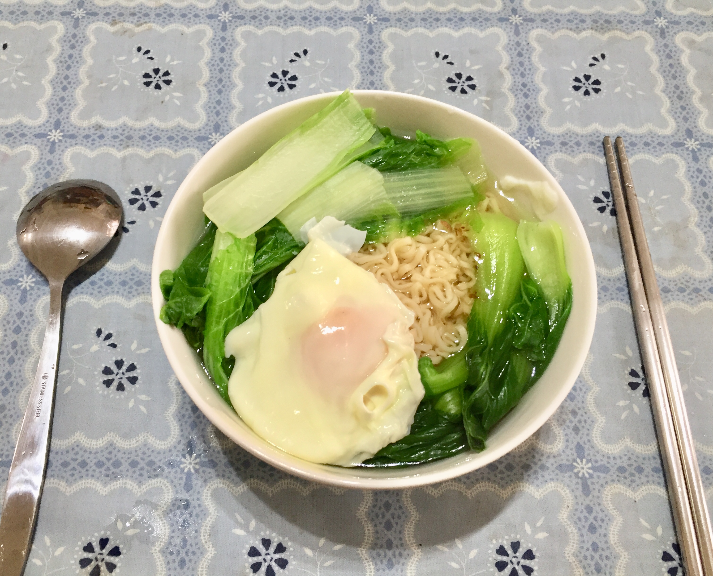
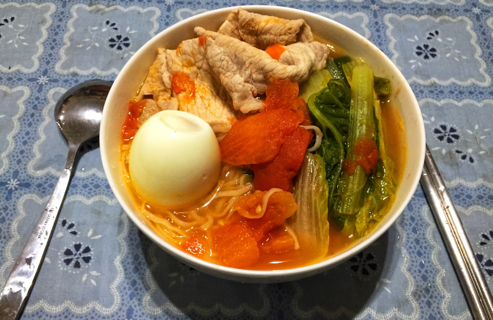
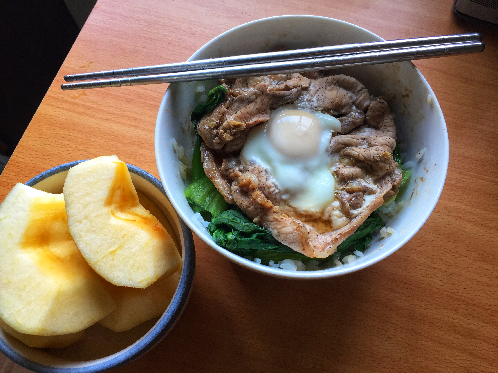

## 嘿，我讀清大，我自主健康管理了一週

因清大可憐的外籍博後學長確診，且我室友剛好是該實驗室的，我開始了為期一週的自主健康管理，不去實驗室爆忙時有好多獨處的時間，想特別記錄為期一週(3/24~3/31)管理自己的心得，給同樣也需要自主健康管理或不能出門的人參考。重要的事情先說，我這一週驕傲的確實做到： 
__一、非必要不出門 (每天等於小於一次)，必要出門的話戴口罩。__  
__二、早晚量體溫 (我買不到耳溫計，聽呂仁碩老師的聰明建議去找找看腋溫計，結果找到了，有需要的人可以去試試看)。__  
__三、定期酒精消毒門把等常碰到的地方，不碰眼口鼻。__

我衷心感謝自己身為台灣人，能知道正確的確診人數與行動分佈，能有口罩可以用，能有強大的醫療和科研團隊，能有很多平常我們注意不到的好康，也超爆感謝第一線醫療人員、政府、和大家的努力到現在還能控制住疫情，但大家出門還是要戴口罩，有人不戴講話打噴嚏噴出的飛沫會沾染到乖乖戴口罩的人，**在清大附近這過去的一週出門時還是看到很多人沒戴口罩。「你不怕，我很怕！」**

因此，這邊我想分享三個這一週在家獨處的重要心得： 
**一、關心身邊的家人和朋友很重要，「如果他們不幸在自主健康管理或隔離，傳個訊息關心他們一下吧！」。  二、自主健康管理在家還是可以充實過日子，現在是投資自己最佳的時間。  三、運動一下、中午煮個飯，換個念頭轉換心情閉關很快就過了。**

在閉關一週內最有感的是家人和身邊重要的朋友會默默的浮出來關心你，在家一個人的時間我雖然都在房間內，但卻好不熱鬧 (不是靈異事件)，有球隊學弟傳訊息關心，爹娘沒事打來喇賽，大小阿姨打電話過來和物資支援，甚至還有女友她爸打電話來關心，真的嚇爛我 (我看到 line 的電話響了直接跳起來在房間走兩圈)，重中之重，也謝謝小可愛每天打電話過來聊聊天，等疫情穩定點再陪你出去玩。**所以，如果身邊有家人朋友情人剛好也在自主健康管理，傳個訊息或打個電話關心他們一下吧，真的會超開心的**。

在家當然也可以選擇整天 Youtubing 或是 Netflixing，但其實我們可以做很多其他的事情，簡單說像是之前一直想學的線上課程或新領域都值得嘗試，當然我不是說說，這一週我有印象做的事情包括：參加[大專盃 IC 設計競賽初賽](http://icdc.ee.nsysu.edu.tw/2020/index2.php?page=News)，去年我太過自負沒練習就上場，今年謹慎的多練了幾次考古總算準時過關、收到 Google 獵頭信件(後來 concall 完發現只是 HR screening，沒什麼大不了，但收到信還是很興奮)、協助撰寫實驗室計畫結案報告、第一次使用遠端開會軟體報告論文等。另外私心推薦我自己最近發現很棒的理財節目YT頻道「[夯翻鼠FQ](https://youtu.be/yd3fZRrjzGM)」，**我相信如果你決定在這段時間好好投資自己，過完後你將獲得滿滿成就感，等不及想跟朋友分享你是怎麼度過的**。

我必須得說，被要求盡量待在家在前期對我心情上的負面影響還是蠻明顯的，有一種被剝奪自由的感覺，因為我之前是喜歡忙累了就出去走走的人，因此我在閉關的第三天出現了明顯的倦怠感，覺得做什麼事情都提不起勁。好險我後來發現如果把時間切開，不要都坐在電腦前，做其他事情來轉換心情，就能稀釋強迫自己持續窩在電腦前的壓抑感，我選擇的方法是早上起床先健身，這邊附上我參考的在家運動影片 [[1]](https://youtu.be/IfSm5obHlRo), [[2]](https://youtu.be/xm9nVP2VnyE)，並且中午或晚餐不要只泡泡麵，可以練習煮煮看不同的東西 [[3]](https://youtu.be/HjQTPraecbg)，**嘗試找到適合自己透透氣的方式，安排新的時間規劃，想想這一週強迫不出們可能讓你因禍得福**。

最後，祝福大家不需要在家閉關，身邊的人不會確診，疫情早點穩定，謝謝家人和朋友的陪伴，我要回高雄陪家人曬太陽和吃飯了，附上我每一天煮飯的照片跟大家分享。

  

### 相關新聞報導
- [CNA](https://www.cna.com.tw/news/firstnews/202003245009.aspx)
- [Storm](https://www.storm.mg/article/2441320)
- [Apple](https://tw.appledaily.com/life/20200324/F4EPF5NRZPIO4SQPDXNJDVUNME/)

[back to blog homepage](../blog.html)