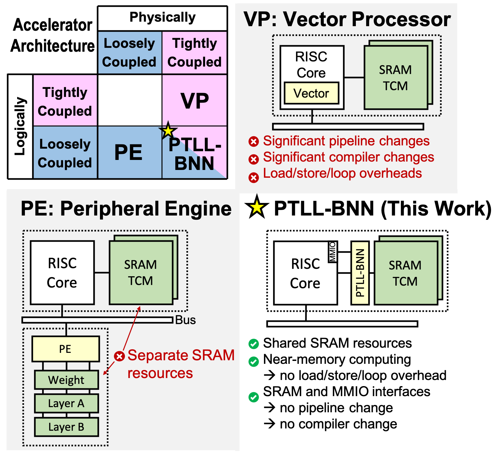

## Bio
**Yun-Chen Lo** (Jason) is currently pursuing his master degree at EE Department, National Tsing Hua University, Taiwan.  His research interest includes Computer Architecture, more specifically includes **HW/SW co-design and accelerator design for convolutional neural networks**.  He publishes 4 papers, two of the papers won **silver award** of ACM **Student Research Competition at MICRO 2018 and 2019**, respectively. In addition, He completes **2 functioning chip Tape-outs**.

He is currently a member of System and Storage Design Lab (advised by [Prof. Ren-Shuo Liu](https://www.ee.nthu.edu.tw/renshuo/)). He also attends [ENIAC team](https://eniac.ee.nthu.edu.tw/index.html) (Co-advised by [Prof. Ren-Shuo Liu](https://scholar.google.com/citations?hl=en&user=KEshqdcAAAAJ), [Prof. Meng-Fan Chang](https://scholar.google.com.tw/citations?user=7rcOEiIAAAAJ&hl=zh-TW), [Prof. Chih-Cheng Hsieh](https://scholar.google.com.tw/citations?user=eBnwkkQAAAAJ&hl=zh-TW), [Prof. Kea-Tiong Tang](https://scholar.google.com/citations?user=DiSis28AAAAJ&hl=en) and [Prof. Chung-Chuan Lo](https://scholar.google.com/citations?user=zULxPHYAAAAJ&hl=zh-TW)) to conduct reseaches including neuromorphic computing, computing in memory (CIM), computing in sensor (CIS) and flexible deep learning architecture design.

- [Resume (Last Update: Oct. 2019)](https://drive.google.com/file/d/1QGFCl5tX7kb_BmRS08KPIeKVAKxrQaK9/view?usp=sharing)
- [Google Scholar](https://scholar.google.com/citations?user=DfbwFFgAAAAJ&hl=zh-TW)
- [My Blog](./Blog/blog.html)

## Publications
(* indicates equal contribution)

#### **AI Edge Devices Using Computing-In-Memory and Processing-In-Sensor: From System to Device** (IEDM'19 Invited)
- Tzu-Hsiang Hsu, Yen-Cheng Chiu, Wei-Chen Wei, __Yun-Chen Lo__, Chung-Chuan Lo, Ren-Shuo Liu, KeaTiong Tang, Meng-Fan Chang, Chih-Cheng Hsieh
- [Paper Link](https://ieeexplore.ieee.org/abstract/document/8993452)

#### **PTLL-BNN: Physically-Tightly-coupled, Logically-Loosely-coupled, Near-Memory BNN Accelerator**  (SRC @ MICRO'19 Graduate Group Silver Award Winner)   (ESSCIRC'19 Accepted)

- __Yun-Chen Lo__, Yu-Chun Kuo, Yun-Sheng Chang, Jian-Hao Huang, Ruen-Shen Wu, Wen-Chien Ting, Tai-Hsing Wen, and Ren-Shuo Liu
- [Paper Link](https://ieeexplore.ieee.org/abstract/document/8902909)
- [MICRO SRC Accepted Papers](https://www.microarch.org/micro52/program/src.html)
- [ACM SRC Winner List](https://src.acm.org/winners/2020)

 

#### **FlexNet: Neural Networks with Inherent Inference-Time Bitwidth Flexibility**  (SRC @ MICRO'18 Undergraduate Group Silver Award Winner)  (ICCD'19 Work-In-Progress Poster Accepted)

- Yu-Shun Hsiao∗, __Yun-Chen Lo*__, and Ren-Shuo Liu 
- [Paper Link](https://www.microarch.org/micro51/SRC/posters/25_hsiao.pdf)
   
    

#### **DrowsyNet: Convolutional Neural Networks with Runtime Power-Accuracy Tunability Using Inference-Stage Dropout**  (VLSI-DAT'18)
- Ren-Shuo Liu, __Yun-Chen Lo__, Yuan-Chun Luo, Chih-Yu Shen, and Cheng-Ju Lee
- [Paper Link](https://ieeexplore.ieee.org/document/8373242/)
   
    
  
## Awards & Scholarships
### 2019
- **Silver Award** on **ACM/IEEE MICRO-52 Student Research Competition (SRC)**, Graduate Group
- **NOVATEK Scholarship**
- **Artificial Intelligence and Information Technology Outstanding Research Award** from **Appier Inc.**

### 2018
- **Artificial Intelligence and Information Technology Outstanding Research Award** from **Appier Inc.**
- **Silver Award** on **ACM/IEEE MICRO-51 Student Research Competition (SRC)**, Undergraduate Group
- **MICRO Student Travel Grant**

### 2017
- **Gold Award** on **Meichu Hackthon** (104 HR Corporation Division, largest Taiwan HR Website Company)
- **Gold Award** on **National Tsing Hua EE Student Project Competition**
- **Silver Award** on **National Tsing Hua EECS Student Project Competition**

### 2016, 2015
- **Silver & Bronze Award** on **Taiwan University Chinese Debate Competition** 2016, 2015, respectively.

	
## Selected Open-Source Projects
1. [**Lenet Accelerator (16 stars, 12 forks)**](https://github.com/jasonlo0509/Lenet_Accelerator)
2. [**Dockerized YOLO on Rpi Cluster (1 star, 1 fork)**]((https://github.com/jasonlo0509/Dockerized-YOLO-on-Rpi-Cluster))
3. [**Hadoop PageRank (1 star)**](https://github.com/jasonlo0509/Hadoop_PageRank)
4. [**Font2Font (5 stars, 1 fork)**](https://github.com/jasonlo0509/Font2Font)

## Internships
	
- **eMemory (Top embedded Flash Memory IP provider)**
    - Research Intern (2017 Summer)
        - Conducted computing in memory research 
        - Conducted internal Tutorial for audience including CEO, CMO and many engineers.
    - Operation Assistance, Legal Department (2015 Summer)
        - Analyzed external patents

- **Microsoft**
    - H1 Online Team Project Manager, Microsoft Student Partners in Taiwan (2016)

## Programming Language & Tools
- **Hardware Related:** Verilog, System Verilog, System-C (HLS)
- **Software Related:** C, Python, Java, Bash script
- **Tool:** Xilinx Vivado (FPGA), Design Compiler & IC Compiler (Digital VLSI Design), Cadence Stratus (High Level Synthesis)

## Professional Activities
- Reviewer for VLSI Symposium, DAC, ICCAD, and PACT.

